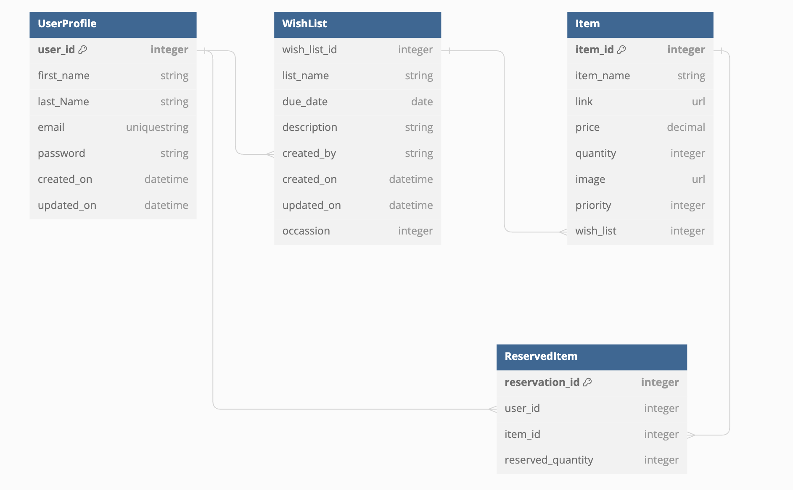

# Your Wish List Maker
Full-Stack Toolkit Portfolio Project(PP4) - Code Institute

View the deployed site [here.]()<br>

 *Your Wish List Maker* is a website designed to help people keep their wish lists for special occasions organised.  
 It is a full stack Django project running on Heroku.

<br>

## Table of contents

- [User Experience](#user-experience)
  - [Milestones](#milestones)
  - [Epics and User stories](#epics-and-user-stories)
- [Design](#design)
  - [Wireframes](#wireframes)
  - [Logo](#logo)
  - [Favicon](#favicon)
  - [Typography](#typography)
  - [Structure](#structure)
- [Features](#features)
- [Bugs](#bugs)
- [Technologies Used](#technologies-used)
  - [Languages](#languages)
  - [Tools](#tools)
  - [Frameworks](#frameworks)
  - [Libraries and modules](#libraries-and-modules)
- [Testing](#testing)
  - [Validator Testing](#validator-testing)
  - [Lighthouse Test](#lighthouse-test)
  - [Manual testing](#manual-testing)
  - [Browser Compatibility](#browser-compatibility)
- [Deployment](#deployment)
  - [Heroku](#heroku)
  - [Forking this GitHub repository](#forking-this-github-repository)
  - [Clone this repository](#clone-this-repository)
- [Credits](#credits)
  - [Content](#content)
  - [Code](#code)
  - [ReadMe](#readme)
  - [Acknowledgments](#acknowledgments)

## User Experience

I used an Agile methodology approach to plan this project. This was implemented through the GitHub Project board with milestones, epics, user storie and tasks.
Each user story was classified with a label according to MoSCoW prioritization.<br>
The Kanban board can be seen [here](https://github.com/users/queenisabaer/projects/3/views/1).

### Milestones

The project was divided into three milestones, each containing the corresponding epics and user stories:<br>
- [Basic Website Setup](https://github.com/queenisabaer/wishlist/milestone/1)
- [Wishlist MVP Management](https://github.com/queenisabaer/wishlist/milestone/2)
- [Testing and Validation](https://github.com/queenisabaer/wishlist/milestone/4)

### Epics and User stories

*Your Wish List Maker* is for those who are interested in organizing their wish lists for special occasions in one place and sending those wish lists to family and friends to provide them with all the desired items.
Although the website can be used by users of any age, my main target group was working parents, especially women between 30-50 years. <br>

List of Epics: <br>
- [EPIC 1: Repository and agile tool](https://github.com/queenisabaer/wishlist/issues/2)
- [EPIC 2: Basic Website and Database Structure](https://github.com/queenisabaer/wishlist/issues/3)
- [EPIC 3: User authentication](https://github.com/queenisabaer/wishlist/issues/4)
- [EPIC 4: Wish List Management](https://github.com/queenisabaer/wishlist/issues/5)
- [EPIC 5: Testing](https://github.com/queenisabaer/wishlist/issues/6)
- [EPIC 6: Validation](https://github.com/queenisabaer/wishlist/issues/7)

User Stories with their id:  <br>
- As a new website user I am able to identify the website's goal so that I can decide whether to continue or leave. [#9](https://github.com/queenisabaer/wishlist/issues/9)
- As a new user I can register an account so that I can create and manage wish lists or items of other wish lists. [#12](https://github.com/queenisabaer/wishlist/issues/12)
- As a registered user, I want to log in to my account so that I can create, read, update and delete my wish list(s) [#13](https://github.com/queenisabaer/wishlist/issues/13)
- As a registered user I want to manage my profile so that I can update my account. [#13](https://github.com/queenisabaer/wishlist/issues/13)
- As a registered user, I want to edit my wishlist so that I can update its details. [#16](https://github.com/queenisabaer/wishlist/issues/16)
- As a registered user, I want to be able to delete a wishlist so that I can remove outdated or unnecessary lists. [#17](https://github.com/queenisabaer/wishlist/issues/17)
- As a registered user, I want to edit items in my wishlist so that I can update their details.[#19](https://github.com/queenisabaer/wishlist/issues/19)
- As a registered user, I want to be able to delete items from my wishlist so that I can remove unwanted items.[#20](https://github.com/queenisabaer/wishlist/issues/20)
- As a registered user, I want to reserve an item of a wishlist, so that no other user will purchase this. [#23](https://github.com/queenisabaer/wishlist/issues/23)
- As a registered user, I want to be able to collaborate on a wishlist with others so that we can collectively manage it. [#24](https://github.com/queenisabaer/wishlist/issues/23)
- As a logged-in user, I want to update my profile information so that my account details are current. [#14](https://github.com/queenisabaer/wishlist/issues/14)
- As a frequent website user I can easily login to my account so that I have access to my wish lists and items I want to purchase. [#9](https://github.com/queenisabaer/wishlist/issues/9)
- As a user of the website I want to create a wish list for a specific occasion so that I can organize my desired items. [#15](https://github.com/queenisabaer/wishlist/issues/15)
- As a user, I want to add items to my wishlist so that I can keep track of things I want. [#18](https://github.com/queenisabaer/wishlist/issues/18)
- As a user, I want to share my wishlist with others so that they can see my wishlist and know what I want to have. [#22](https://github.com/queenisabaer/wishlist/issues/22)
<br>

- As a developer I want to define a database structure so that it matches the objectives of the project. [#10](https://github.com/queenisabaer/wishlist/issues/10)
- As a developer I want to set up and configure a database so that I can store and manage the application data securely and efficiently. [#11](https://github.com/queenisabaer/wishlist/issues/11)
- As a developer, I need to verify that all html files pass the W3C validation so that the code is executed correctly. [#25](https://github.com/queenisabaer/wishlist/issues/25)
- As a developer, I need to verify that my css files pass the W3C validation so that the code is executed correctly. [#26](https://github.com/queenisabaer/wishlist/issues/26)
- As a developer, I need to verify that my JavaScript files pass the jshint validation so that the code is executed correctly. [#27](https://github.com/queenisabaer/wishlist/issues/27)
- As a developer, I need to verify that my python files pass the pep8 validation so that the code is executed correctly. [#28](https://github.com/queenisabaer/wishlist/issues/28)
- As a developer, I want to implement python test procedures so that I can assess functionality, usability, responsiveness and data management throughout the web application. [#29](https://github.com/queenisabaer/wishlist/issues/29)
- As a developer, I want to implement JavaScript test procedures so that I can assess functionality, usability, responsiveness and data management throughout the web application. [#30](https://github.com/queenisabaer/wishlist/issues/30)
- As a developer, I want to implement manual test cases so that I can assess functionality, usability, responsiveness and data management throughout the web application. [#31](https://github.com/queenisabaer/wishlist/issues/31)
<br>

- As an admin I want to access the site's administrative features so that I have access to the admin panel. [#8](https://github.com/queenisabaer/wishlist/issues/8)

## Design

### Wireframes
Due to lack of time, some of the originally planned features that can be seen on the wireframe had to be deleted or implemented differently. A detailed description of the existing features can be found [here](#features). 

<details>
<summary> Home </summary>
<br>


</details>

<details>
<summary> About </summary>
<br>


</details>

<details>
<summary> Create New Wish List </summary>
<br>


</details>

<details>
<summary> Add Item </summary>
<br>


</details>

<details>
<summary> User Dashboard </summary>
<br>


</details>

<details>
<summary> Sign Up </summary>
<br>


</details>

<details>
<summary> Sample Wish List </summary>
<br>


</details>

- **Imagery:**<br>
 
The background image was found at pixabay and was created by [blickpixel](https://pixabay.com/de/photos/geschenk-p%C3%A4ckchen-%C3%BCberraschung-548296/) It was used to create the color palette and logo. The colors are rather soft and playful and the three gifts represent very well the theme of the site. 

### Logo

The logo was made with [Canva](https://www.canva.com/). The font that was used to add the title is supposed to remind of handwritten greeting cards.<br>

  <br>

### Favicon

The favicon was created with [Favicon.io](https://favicon.io/favicon-generator/)

  

### Colour Scheme:
  
The colour palette was generated using the pipette function on the photo with the presents that was used as background. The main colours are glaucous, snow, pink and magenta.  

<details>
<summary> Click here to see the colour palette </summary>
<br>

I created the colour palette with [coloors](https://coolors.co/).<br>
<br>

</details>

### Typography

[Indie Flower](https://fonts.google.com/specimen/Indie+Flower) was used as font for headings. It is a handwriting font that seems carefree and open. Although it is a handwriting font it is still easy to read.<br>
[Rubik](https://fonts.google.com/specimen/Rubik?query=rubik) was selected for text content. It is a sans-serif font which is easy to read, and has a certain aestethic. Both fonts were imported via Google Fonts. 

### Structure 

The database schema was crafted during the planning phase of the project and was created with [dbdiagramm](https://dbdiagram.io/home). It still displays the reserved item modal, that I would love to implement in the future. In addition, the user profile still contains email and password, which are directly retrieved in the final version from the profile created for authentication. 




## Features

### Existing Features

To learn more about each feature, please click on the respective headline

<details>
<summary> Header with logo and navbar </summary>
<br>

To ensure uniformity and a sense of familiarity for users, all pages include the same header with navigation links and an identical footer.
The header consists of the logo, which is always arranged on the right and acts as a link to return to the main page. On the left side is the navigation bar, which turns into a clickable burger menu on smaller screens. Depending on whether the user is logged in or not, the navigation elements adapt accordingly. <br>
View for users who are not logged in:<br>
<br>
<br>
<br>
View for users who are logged in:<br>
<br>
<br>
<br>


</details>

<details>
<summary> Footer </summary>
<br>

To ensure uniformity and a sense of familiarity for users, all pages include the same header with navigation links and an identical footer. Unlike the original wireframes, the footer does not contain a contact link or a link to Facebook and Instagram. Instead, the repository for this project and the personal linkedin profile have been pointed out, from where it is possible to contact the owner of the page. <br>
<br>
<br>

</details>

<details>
<summary> Home(Welcome) page </summary>
<br>

The home page contains a short welcome text for first-time visitors or users who are not logged in, giving them the possibility to sign up or log in to use the application. The navigation bar only has three options: 'Home', 'Login' and 'Sign Up'. Two buttons each lead to the pages to log in or sign up. After signing up or logging in, this page changes. The navigation bar then contains the possibility to access the following pages: 'Home', 'New List', 'Profile', 'Overview' and 'Logout'. The buttons then lead to the possibility to create a new wishlist or to call up the own profile.
<br>
<br>


</details>

<details>
<summary> Login </summary>
<br>

xxx <br>
<br>

</details>


### Features, which I would like to implement in the future

- Possibility to reserve an item and display the reserved items at the profile page
- Full CRUD functionality for items
- Functionality to create a wish list even if I'm not a registered user
- Improve accessibility of buttons

## Bugs

<details>
<summary> TEMPLATES_DIR </summary>
<br>
After I tried to load the home app, I was shown that the template base.html does not exist due to the fact that I recalled the TEMPLATES_DIRS as string. After removing the quotation mark, everything worked.
<br>
<br>

<br>
<br>

</details>

<details>
<summary> Log In </summary>
<br>
After I tried to log in, I was shown that the current path does not exist. I could fix this bug by adding the url directly to the action attribute. 
<br>
<br>

<br>
<br>

</details>

<details>
<summary> Links in Navbar </summary>
<br>
If I clicked on the links in the navigation bar (for example for login or logout), a wrong URL was created resulting in the error shown in the screenshot. After setting the url paths in a different way, I could fix this error. 
<br>
<br>

<br>
<br>
Solved: <br>
<br>

</details>

<details>
<summary> Authentication Error for password reset</summary>
<br>
If I tried to reset my password and then entered the email address to receive a link, I was shown the following message. I was able to solve this by creating a new Google app password and enabling imap. Now the user receives an email with a link to reset the password and is redirected to the corresponding website. 
<br>
<br>

<br>
Solved: <br>
<br>

</details>

<details>
<summary> Error for profile page</summary>
<br>
After I created the UserProfile model, there was an error when you wanted to call up your own profile in the published version. This could be solved by including sender to the arguments of the create_user_profile method. 
<br>
<br>

</details>

<details>
<summary> Not null for wish list id</summary>
<br>
In the original version of the UserProfile model, a wishlist had to be assigned to the user, which caused the following error. After adding null=True to the attribute wish_list_id, this bug could be fixed. 
<br>
<br>

<br>

</details>

## Technologies Used

### Languages:
- [HTML5](https://en.wikipedia.org/wiki/HTML5)
- [CSS](https://en.wikipedia.org/wiki/CSS)
- [JavaScript](https://www.javascript.com/)
- [Python](https://en.wikipedia.org/wiki/Python_(programming_language))

### Tools:
- [Git](https://git-scm.com/) was used for version control by utilizing the Gitpod terminal to commit to Git and Push to GitHub.
- [GitHub](https://github.com/) was used to save and store the files for the website.
- [Heroku](https://www.heroku.com) was used to deploy the application.
- [VS Code](https://code.visualstudio.com/) was used as IDE. 
- [Code Insitute Database Maker](https://dbs.ci-dbs.net/)PostgreSQL database hosting for this project
- [Fontawesome](https://fontawesome.com/) was used to add icons to the website.
- [Balsamiq](https://balsamiq.com/) was used to create the wireframes.
- [Lucid](https://lucid.app/) was used to create the Flowchart.
- [Black Formatter](https://marketplace.visualstudio.com/items?itemName=ms-python.black-formatter) to beautify the code
- [Beautifier](https://beautifier.io/) to beautify the html code
- [LanguageTool](https://languagetool.org/) was used to check the grammar and spelling in the README and the Code. 
- [Coloors](https://coolors.co/image-picker) was used to create the color scheme.
- [Pixelied](https://pixelied.com/convert/jpg-converter/jpg-to-webp) was used to convert jpg images into wepb images.
- [Tinypng](https://tinypng.com/) was used to compress the webp background-image.
- [Pixabay](https://www.pixabay.com/de-de/) was used to search and load the background image.
- [QuickTime Player](https://support.apple.com/en_GB/downloads/quicktime) was used to create for recording the screen.
- [xconvert](https://www.xconvert.com/) was used to convert the screen recording from mov into gif.
- [Browserling](https://www.browserling.com/) was used to test the application on different browsers.
- [Müllmail](https://muellmail.com/)was used to create temporary mails to check login functionality. 
- [Cloudinary](https://cloudinary.com/) was used to store the item images.
- [Canva](https://www.canva.com/) was used to create the logo.
- [Favicon.io](https://favicon.io/favicon-generator/) was used to create the favicon.
- [Google Chrome Dev Tools](https://developer.chrome.com/docs/devtools?hl=de) was used to check the application for responsiveness and errors. 

### Frameworks: 
- [Bootstrap](https://getbootstrap.com/) 
- [Django](https://en.wikipedia.org/wiki/Django_(web_framework))
- [jquery](https://jquery.com/)

### Libraries and modules:
- [os](https://docs.python.org/3/library/os.html) provides functions to interact with the operating system. 
- [sys](https://docs.python.org/3/library/sys.html) was used to get system-specific functions.
- [datetime](https://docs.python.org/3/library/time.html) supplies classes for manipulating dates and times.
- [Gunicorn](https://gunicorn.org/) provides a way to serve Python web applications.
- [Pycopg 2](https://pypi.org/project/psycopg2/) is a PostgreSQL database adapter for Python.
- [Allauth](https://docs.allauth.org/en/latest/) was used to handle user authentication, registration, and account management.
- [Crispy Forms](https://django-crispy-forms.readthedocs.io/en/latest/) is a Django application to manage and to render to render the forms.
- [Whitenoise](https://whitenoise.readthedocs.io/en/stable/) was used to serve static files.
- [Summernote](https://summernote.org/) as text-editor for admin panel. 
- [dj_database_url](https://pypi.org/project/dj-database-url/) enables the ability to represent their database settings via a string.
- [random](https://docs.python.org/3/whatsnew/3.12.html#random) implements a pseudo-random number generator.
- [string](https://docs.python.org/3/whatsnew/3.11.html#string) contains a collection of string operations and constants.

## Testing

The app was tested regularly and deployed early to Heroku to make sure both local and remote worked the same.

### Validator Testing

<details>
<summary> HTML Validation</summary>
<br>

All HTML pages were run through the [W3C HTML Validator](https://validator.w3.org/). <br>
  - result for 'home' page<br>
    <br>
  - result for 404.html<br>
  
  <br>
  
</details>

<details>
<summary> CSS Validation</summary>
<br>

I passed my css file through the [CSS Validator](https://jigsaw.w3.org/css-validator/) and no errors were found.<br>
     

  
</details>

<details>
<summary> JavaScript Validation</summary>
<br>

I passed my javaScript file through the [JSHint](https://jshint.com/). In the first attempt three warnings were found due to two missing semicolons and ths usage of the async function, which is only available in ES8. After searching on Slack, I found a useful thread of [Joanna Skoczen](https://code-institute-room.slack.com/archives/C7EJUQT2N/p1662139410703239) and used the following statement to get rid of the error: 
```//jshint esversion:8``` 
<br>
<br>
     


The statement of one undefinied variable is caused by cross referencing scripts. 
  
</details>

<details>
<summary> Python Validation</summary>
<br>

All created python files were checked with the [Code Insitute validator](https://pep8ci.herokuapp.com/#). Since some lines were too long, they had to be corrected, after that everything was clear and no errors where found<br>
  
</details>


### Lighthouse Test
To measure the website against performance, accessibility, SEO and best practice, I used [Lighthouse](https://chromewebstore.google.com/detail/lighthouse/blipmdconlkpinefehnmjammfjpmpbjk?hl=de).<br>
Because the background and foreground colors of the button with the class: 'btn-pink' and 'btn-reverse' do not have a sufficient contrast ratio, the accessibility was 95. I tried to improve this by changing the background colors to more vibrant ones, but couldn't get a better result. Since time was running out, I left it in the original version at the end. I would like to optimize this in a future version. 
<details>
<summary> Results </summary>
<br>

  - Home Page
  
  
</details>

### Manual testing

<details>
<summary> Click here to see the testing table for features</summary>
<br>

| **Test** | **Test Description** | **Expected Outcome** | **Result** |
|:---|:---|:---|:---|
| Header - Logo | Click on the logo to return to main page | Clicking on the logo on each page will return you to the main page | Pass |
| Header - Navbar toggler in tablet/mobile view | Click in tablet/mobile view on the burger icon to open the navigation | When the burger icon in mobile or tablet view is clicked, the navigation should open | Pass |
| Header - Navigation underline | The page you are currently on should be underlined in the menu | After reaching a page at the application the corresponding navigation item should be underlined | Pass |
| Header - Navigation link | Click on a term in the navigation bar to go to the corresponding page | Clicking on a page at the navigation bar should take the user to the corresponding page | Pass |
| Header - Navigation links and items | Depending wheter the user is logged in or not, the navigation elements should adapt accordingly | After logging in, the navigation menu should adjust accordingly. | Pass |
| Footer - Icons | Click on the logo of GitHub or LinkedIn and a new tab with the repository page of this project or the personal LinkedIn profile page opens | After clicking on the logo of GitHub it should open a new tab with the repository page for this project, and after clicking on the LinkdIn logo, LinkedIn should open in a new tab as well | Pass |
| Main page - default version | Visit the website for the first time or don't be logged in to see the default version of the 'home' page | After visiting the website for the first time or if a user isn't logged in, the main page should contain a short welcome message, with two buttons to sign up or log in, and a navigation bar that only contains three elements: 'Home', 'Login' and 'Sign Up'. 'Home' should be underlined| Pass |
| Main page - Log in version | Log in to see a modified version of the 'home' page | After logging in the 'home' page should contain a short welcome message, with two buttons to sign up or log in, and a navigation bar that contains five elements: 'Home', 'New List', 'Profile', 'Overview' and 'Logout'. 'Home' should be underlined| Pass |


</details>

<details>
<summary> Click here to see the testing table for User Stories</summary>
<br>

| **User Story** | **Acceptance Criteria** | **Was achieved as follows** |
|:---|:---|:---|
| #9 As a new website user I am able to identify the website's goal so that I can decide whether to continue or leave. | The website should display a clear and concise description or tagline that communicates the website's primary purpose within the first few seconds of viewing. It should include visual elements and navigational cues that help explain the website's goal and functionality. | A home page has been created that displays a small introductory text for first time visitors or users who are not logged in. In addition, the heading, the background image, the logo and the favicon already indicate the meaning of the page. |


</details>

### Browser Compatibility
  The tests were conducted using the following browsers:

- Google Chrome Version 121.0.6167.160 <br>
The following tests were conducted by using [browserling](https://www.browserling.com/) <br>
- Edge Version 118
- Firefox 119
- Opera 104

I have tested the website on Safari on macOS Sonoma 14.3, but unfortunately, it just opens the website and starts the program, but I can’t enter any input.


## Deployment NEEDS UPDATE

### Heroku
This site is deployed using Heroku. To deploy it from its GitHub repository to Heroku, I took the following steps:

1. Create a list of requirements in the requirements.txt file by using the command _pip3 freeze > requirements.txt_
2. Log in (or sign up) to Heroku
3. Click on the _New_ button and select _Create new app_
4. Give it a unique name and choose the region _Europe_
5. Click the *Settings* tab, go to the _Config Vars_ section and click on the _Reveal Config Vars_ button
6. Copy the content of the creds.json file() and paste it into the value field, then name the _Key_ CREDS, like the variable that holds the json file in the run.py file
7. Click the _Add_ button
8. Add a second key _PORT_ and set the value to _8000_
9. Go to the _Buildpacks_ section and click the _Add Buildpacks_ button
10. Select _python_ and click the _Save changes_ button
11. Add a second buildpack: _nodejs_
12. Click the *Deploy* tab, go to the _Deployment method_ section, select _GitHub_ and confirm this selection by clicking on the _Connect to Github_ button
13. Search for the repository name on github _life-in-numbers_ and click the _Connect_ button 
14. Enable the automatic deploy or manually deploy the code from the main branch.<br>

To see the [view of the live site]() click on the _Open app_ button on the top right corner or, if you enabled automatic deploy(step 14), log in to GitHub, navigate to the repository for this project by selecting [*queenisabaer/wishlist*](https://github.com/queenisabaer/wishlist), click on _Deployment_ and choose in the _Environments_ section _life-in-numbers_. On top of the latest deployment is the link to the [live site]().

### Forking this GitHub repository
1.  Log in to GitHub.
2.  Navigate to the repository for this project by selecting [*queenisabaer/wishlist*](https://github.com/queenisabaer/wishlist)
3. Click at the top of the repository on the **Fork** button on the right side

### Clone this repository
1.  Log in to GitHub.
2.  Navigate to the repository for this project by selecting [*queenisabaer/wishlist*](https://github.com/queenisabaer/wishlist)
3. In the top right corner, click on the green *Code* button
4. Copy the HTTPS URL in the tab *Local*
5. Go to the code editor of your choice and open the terminal
5. Type `git clone` and paste the URL you copied into your terminal
6. Press the enter key


## Credits

### Content

- 

### Code

- A great help and inspiration was the [*Django Recipe Sharing Tutorial*](https://www.youtube.com/playlist?list=PLXuTq6OsqZjbCSfiLNb2f1FOs8viArjWy) by Daisy Mc Girr. I used espacially her help with the autentification and the class based views. 
- How to base field on another field by overwriting the save method, was found in an article in [Medium by Marco](https://marcolcl.medium.com/custom-django-model-field-based-on-default-primary-key-d5d13dd61a1c)
- To override important css from bootstrap, I found a great article at [Slack](https://stackoverflow.com/questions/70315624/how-to-add-remove-important-css-with-new-css)
- How to redirect to the login template page with a message was found at [Slack](https://stackoverflow.com/questions/39900679/django-permissionrequiredmixin-redirect-to-login-template-with-message)
- How to get the current url with a django template (for the modal to share a link) was found at [Slack](https://stackoverflow.com/questions/2882490/how-to-get-the-current-url-within-a-django-template)
- How to copy to the clipboard with javascript was found [here](https://sentry.io/answers/how-do-i-copy-to-the-clipboard-in-javascript/) and at [Slack](https://stackoverflow.com/questions/400212/how-do-i-copy-to-the-clipboard-in-javascript)
- How to keep a modal window open if a validation error is raised was found at [reddit](https://www.reddit.com/r/django/comments/4souit/how_to_keep_a_modal_window_open_if_a_validation/)
- The following websites were used as a source of knowledge: <br>
  - [Google](www.google.com)
  - [mdn](https://developer.mozilla.org/en-US/)
  - [W3C](https://www.w3.org/)
  - [W3schools](https://www.w3schools.com/)
  - [DevDocs](https://devdocs.io/)
  - [Stack Overflow](https://stackoverflow.com/)
  - [reddit](https://www.reddit.com/)
  - [forum djangoproject](https://forum.djangoproject.com/)
  - Documentation for Bootstrap, Crispy Forms, Django
  - Slack Community

### ReadMe

- Still, a big thank you to [Kera Cudmore](https://github.com/kera-cudmore) and all of her tips on what makes a good README.

### Acknowledgments

- I would like to express my deepest gratitude to my excellent mentor Brian Macharia for his numerous tips and wonderful assistance during the creation of this project, especially his help with adding items to the wish list..  
- A big thank you to Dennis Schenkel for all his help on this project, be it brainstorming sessions to refine the code or emotional support. 
- Furthermore, I would like to thank Lino Bollansee. I greatly appreciate his frequent comments during the creation of my project.

**This is for educational use.**