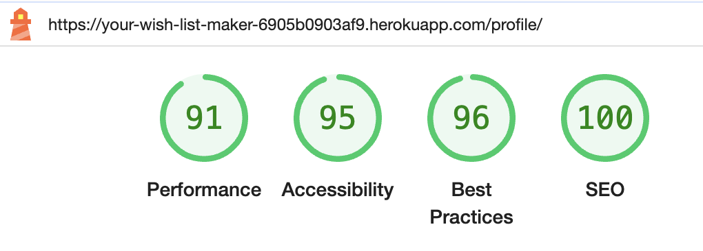

# Your Wish List Maker
Full-Stack Toolkit Portfolio Project(PP4) - Code Institute

View the deployed site [here.](https://your-wish-list-maker-6905b0903af9.herokuapp.com/)<br>

 *Your Wish List Maker* is designed for users who want to efficiently manage and organize their wish lists for various occasions such as birthdays, holidays, and weddings. This application allows users to create, edit, and categorize wish lists, making it easy to keep track of desired items. Users can effortlessly share their lists with family and friends, ensuring everyone knows exactly what gifts are wanted. Additionally, the app supports links to online stores, helping gift-givers find and purchase the perfect presents with ease.
 It is a full stack Django project running on Heroku.

<br>

## Table of contents

- [User Experience](#user-experience)
  - [Milestones](#milestones)
  - [Epics and User stories](#epics-and-user-stories)
- [Design](#design)
  - [Wireframes](#wireframes)
  - [Logo](#logo)
  - [Favicon](#favicon)
  - [Typography](#typography)
- [Structure](#structure)
- [Database](#database)
- [Features](#features)
- [Bugs](#bugs)
- [Technologies Used](#technologies-used)
  - [Languages](#languages)
  - [Tools](#tools)
  - [Frameworks](#frameworks)
  - [Libraries and modules](#libraries-and-modules)
- [Testing](#testing)
  - [Validator Testing](#validator-testing)
  - [Lighthouse Test](#lighthouse-test)
  - [Manual testing](#manual-testing)
  - [Browser Compatibility](#browser-compatibility)
  - [Automated Testing](#automated-testing)
- [Deployment](#deployment)
  - [Heroku](#heroku)
  - [Local deployment](#local-deployment)
  - [Forking this GitHub repository](#forking-this-github-repository)
  - [Clone this repository](#clone-this-repository)
  - [Cloudinary](#cloudinary)
  - [Create PostgresSQL using Code Institute Database Maker](#create-postgressql-using-code-institute-database-maker)
  - [Gmail](#gmail)
- [Credits](#credits)
  - [Content](#content)
  - [Code](#code)
  - [ReadMe](#readme)
  - [Acknowledgments](#acknowledgments)

## User Experience

I used an Agile methodology approach to plan this project. This was implemented through the GitHub Project board with milestones, epics, user storie and tasks.
Each user story was classified with a label according to MoSCoW prioritization.<br>
The Kanban board can be seen [here](https://github.com/users/queenisabaer/projects/3/views/1).

### Milestones

The project was divided into three milestones, each containing the corresponding epics and user stories:<br>
- [Basic Website Setup](https://github.com/queenisabaer/wishlist/milestone/1)
- [Wishlist MVP Management](https://github.com/queenisabaer/wishlist/milestone/2)
- [Testing and Validation](https://github.com/queenisabaer/wishlist/milestone/4)

### Epics and User stories

*Your Wish List Maker* is for those who are interested in organizing their wish lists for special occasions in one place and sending those wish lists to family and friends to provide them with all the desired items.
Although the website can be used by users of any age, my main target group was working parents, especially women between 30-50 years. <br>

List of Epics: <br>
- [EPIC 1: Repository and agile tool](https://github.com/queenisabaer/wishlist/issues/2)
- [EPIC 2: Basic Website and Database Structure](https://github.com/queenisabaer/wishlist/issues/3)
- [EPIC 3: User authentication](https://github.com/queenisabaer/wishlist/issues/4)
- [EPIC 4: Wish List Management](https://github.com/queenisabaer/wishlist/issues/5)
- [EPIC 5: Testing](https://github.com/queenisabaer/wishlist/issues/6)
- [EPIC 6: Validation](https://github.com/queenisabaer/wishlist/issues/7)

User Stories with their id:  <br>
- As a new website user I am able to identify the website's goal so that I can decide whether to continue or leave. [#9](https://github.com/queenisabaer/wishlist/issues/9)
- As a new user I can register an account so that I can create and manage wish lists or items of other wish lists. [#12](https://github.com/queenisabaer/wishlist/issues/12)
- As a registered user, I want to log in to my account so that I can create, read, update and delete my wish list(s) [#13](https://github.com/queenisabaer/wishlist/issues/13)
- As a registered user I want to manage my profile so that I can update my account. [#13](https://github.com/queenisabaer/wishlist/issues/13)
- As a registered user, I want to edit my wishlist so that I can update its details. [#16](https://github.com/queenisabaer/wishlist/issues/16)
- As a registered user, I want to be able to delete a wishlist so that I can remove outdated or unnecessary lists. [#17](https://github.com/queenisabaer/wishlist/issues/17)
- As a registered user, I want to edit items in my wishlist so that I can update their details.[#19](https://github.com/queenisabaer/wishlist/issues/19)
- As a registered user, I want to be able to delete items from my wishlist so that I can remove unwanted items.[#20](https://github.com/queenisabaer/wishlist/issues/20)
- As a registered user, I want to reserve an item of a wishlist, so that no other user will purchase this. [#23](https://github.com/queenisabaer/wishlist/issues/23)
- As a registered user, I want to be able to collaborate on a wishlist with others so that we can collectively manage it. [#24](https://github.com/queenisabaer/wishlist/issues/23)
- As a logged-in user, I want to update my profile information so that my account details are current. [#14](https://github.com/queenisabaer/wishlist/issues/14)
- As a frequent website user I can easily login to my account so that I have access to my wish lists and items I want to purchase. [#9](https://github.com/queenisabaer/wishlist/issues/9)
- As a user of the website I want to create a wish list for a specific occasion so that I can organize my desired items. [#15](https://github.com/queenisabaer/wishlist/issues/15)
- As a user, I want to add items to my wishlist so that I can keep track of things I want. [#18](https://github.com/queenisabaer/wishlist/issues/18)
- As a user, I want to share my wishlist with others so that they can see my wishlist and know what I want to have. [#22](https://github.com/queenisabaer/wishlist/issues/22)
<br>

- As a developer I want to define a database structure so that it matches the objectives of the project. [#10](https://github.com/queenisabaer/wishlist/issues/10)
- As a developer I want to set up and configure a database so that I can store and manage the application data securely and efficiently. [#11](https://github.com/queenisabaer/wishlist/issues/11)
- As a developer, I need to verify that all html files pass the W3C validation so that the code is executed correctly. [#25](https://github.com/queenisabaer/wishlist/issues/25)
- As a developer, I need to verify that my css files pass the W3C validation so that the code is executed correctly. [#26](https://github.com/queenisabaer/wishlist/issues/26)
- As a developer, I need to verify that my JavaScript files pass the jshint validation so that the code is executed correctly. [#27](https://github.com/queenisabaer/wishlist/issues/27)
- As a developer, I need to verify that my python files pass the pep8 validation so that the code is executed correctly. [#28](https://github.com/queenisabaer/wishlist/issues/28)
- As a developer, I want to implement python test procedures so that I can assess functionality, usability, responsiveness and data management throughout the web application. [#29](https://github.com/queenisabaer/wishlist/issues/29)
- As a developer, I want to implement JavaScript test procedures so that I can assess functionality, usability, responsiveness and data management throughout the web application. [#30](https://github.com/queenisabaer/wishlist/issues/30)
- As a developer, I want to implement manual test cases so that I can assess functionality, usability, responsiveness and data management throughout the web application. [#31](https://github.com/queenisabaer/wishlist/issues/31)
<br>

- As an admin I want to access the site's administrative features so that I have access to the admin panel. [#8](https://github.com/queenisabaer/wishlist/issues/8)

## Design

### Wireframes
Due to lack of time, some of the originally planned features that can be seen on the wireframe had to be deleted or implemented differently. A detailed description of the existing features how they differ from the wireframes can be found [here](#features). 

<details>
<summary> Home </summary>
<br>
In the final version of the 'home' page you have to create an account to create a new wishlist. Therefore, the buttons and the navigation bar look different. <br>


</details>

<details>
<summary> About </summary>
<br>
The 'about' page as not implemented in the final project.<br>


</details>

<details>
<summary> Create New Wish List </summary>
<br>
The final approach to creating a wishlist is different from this wireframe. You can only add items in the detailed view of the wishlist and see the link to share the list. <br>


</details>

<details>
<summary> Add Item </summary>
<br>
To add an item to a wish list, a modal opens on the detail page of the wish list. <br>


</details>

<details>
<summary> User Dashboard </summary>
<br>
The user dashboard or profile looks significantly different than originally planned. The functionality to directly display the wish lists has been integrated as a button. Reserving items is only planned for a future version. <br>


</details>

<details>
<summary> Sign Up </summary>
<br>
Unlike this wireframe, first name and last name can be added in the profile view. <br>


</details>

<details>
<summary> Sample Wish List </summary>
<br>
The arrangement of the items was created as a bootstrap card and therefore differs somewhat from this wireframe<br>


</details>

### Imagery
 
The background image was found at pixabay and was created by [blickpixel](https://pixabay.com/de/photos/geschenk-p%C3%A4ckchen-%C3%BCberraschung-548296/) It was used to create the color palette and logo. The colors are rather soft and playful and the three gifts represent very well the theme of the site. 

#### Logo

The logo was made with [Canva](https://www.canva.com/). The font that was used to add the title is supposed to remind of handwritten greeting cards.<br>

  <br>

#### Favicon

The favicon was created with [Favicon.io](https://favicon.io/favicon-generator/)

  

#### Colour Scheme:
  
The colour palette was generated using the pipette function on the photo with the presents that was used as background. The main colours are glaucous, snow, pink and magenta.  

<details>
<summary> Click here to see the colour palette </summary>
<br>

I created the colour palette with [coloors](https://coolors.co/).<br>
<br>

</details>

### Typography

[Indie Flower](https://fonts.google.com/specimen/Indie+Flower) was used as font for headings. It is a handwriting font that seems carefree and open. Although it is a handwriting font it is still easy to read.<br>
[Rubik](https://fonts.google.com/specimen/Rubik?query=rubik) was selected for text content. It is a sans-serif font which is easy to read, and has a certain aestethic. Both fonts were imported via Google Fonts. 

## Structure 

The first database schema was crafted during the planning phase of the project and was created with [dbdiagramm](https://dbdiagram.io/home). It still displays the reserved item modal, that I would love to implement in the future. In addition, the user profile still contains email and password, which are directly retrieved in the final version from the profile created for authentication. 

<br>
Final ERD:<br>
<br>

## Database<br>
I used a PostgreSQL provided by Code Institute as relational database.<br>

- **FieldTypes:**<br>
  - AutoField: An integer field that automatically increments.
  - CharField: A text field with a maximum length.
  - EmailField: A CharField that checks if the value is a valid email address.
  - DateTimeField: A field for storing date and time.
  - DateField: A field for storing dates.
  - TextField: A large text field.
  - OneToOneField: A one-to-one relationship.
  - ForeignKey: A many-to-one relationship.
  - IntegerField: An integer field.
  - DecimalField: A fixed-precision decimal number.
  - URLField: A CharField for URLs.
  - ResizedImageField: An image field with resizing options.<br>
- **Relationships:**<br>
  - A User has one UserProfile.
  - A UserProfile belongs to one User.
  - A WishList is created by one User.
  - A User can create many WishLists.
  - A WishList can have many Items.
  - An Item belongs to one WishList.

## Features

### Existing Features

To learn more about each feature, please click on the respective headline

<details>
<summary> Header with logo and navbar </summary>
<br>

To ensure uniformity and a sense of familiarity for users, all pages include the same header with navigation links and an identical footer.
The header consists of the logo, which is always arranged on the right and acts as a link to return to the main page. On the left side is the navigation bar, which turns into a clickable burger menu on smaller screens. Depending on whether the user is logged in or not, the navigation elements adapt accordingly. <br>
View for users who are not logged in:<br>
  - Screenshot of header in mobile view:<br>
  <br>
  - Screenshot of header in mobile view with toggled navigation:<br>
  <br>
  - Screenshot of header in mobile view with toggled navigation:<br>
  <br>
  <br>
View for users who are logged in:<br>
  - Screenshot of header in mobile view:<br>
  <br>
  - Screenshot of header in mobile view with toggled navigation:<br>
  <br>
  - Screenshot of header in mobile view with toggled navigation:<br>
  <br>


</details>

<details>
<summary> Footer </summary>
<br>

To ensure uniformity and a sense of familiarity for users, all pages include the same header with navigation links and an identical footer. Unlike the original wireframes, the footer does not contain a contact link or a link to Facebook and Instagram. Instead, the repository for this project and the personal linkedin profile have been pointed out, from where it is possible to contact the owner of the page. <br>
Screenshot for footer in mobile view:<br>
<br>
Screenshot for footer on larger screens: <br>
<br>

</details>

<details>
<summary> Home(Welcome) page </summary>
<br>

The home page contains a short welcome text for first-time visitors or users who are not logged in, giving them the possibility to sign up or log in to use the application. The navigation bar only has three options: 'Home', 'Login' and 'Sign Up'. Two buttons each lead to the pages to log in or sign up. After signing up or logging in, this page changes. The navigation bar then contains the possibility to access the following pages: 'Home', 'New List', 'Profile', 'Overview' and 'Logout'. The buttons then lead to the possibility to create a new wishlist or to call up the own profile.<br>
In the wireframe a slightly different approach can be seen. Due to a alck of time, I wasn't able to implement the functionality, so that a wish list can be created without logging in. This is a feature I would like to implement in the future. In addition, I have seen in some other projects where the own LinkedIn profile and the corresponding repository was referenced. I found this approach very nice and therefore adopted it. <br>
Screenshot for home page to log in or sign up:<br>
<br>
Screenshot of home page after log in: <br>
<br>


</details>

<details>
<summary> User authentication and account</summary>
<br>

For the user authentication functionality like: Sign up, Email verification, Log in, Remember me, Password reset, and Log out Django allauth was installed. Success messages inform the user along the process of logging in and out, signing up etc. (e.g. whether they have successfully logged in or logged out).<br> 
Email verification is enforced to ensure that only committed individuals access the page. Users can log in after they have confirmed their email address. Then the user can access its profile and create new wish lists. <br>
Each time a user completes a step successfully, a corresponding message is displayed on the page below the header.<br>

**Screenshots**<br>
Screenshot for Sign Up: <br>
<br>
Screenshot for Verify email: <br>
<br>
Screenshot of the Mail that user receives after signing up: <br>
<br>
Screenshot for Confirm Email page: <br>

Screenshot after clicking the link in the verify email: <br>
<br>
Screenshot of the message following the successful verification: <br>
<br>
Scrrenshot for Log In: <br>
<br>
<br>
Screenshot for Log Out: <br>
<br>
Screenshot of the message following a successful log-out: <br>
<br>
Screenshot for password reset: <br>
<br>
Screenshot of the Mail to reset the password: <br>
<br>
The page to reset the password has not been finally formatted and styled. This is a feature, I would like to implement in the future. 


</details>


<details>
<summary> User Profile </summary>
<br>

The navigation bar allows you to navigate to the user's profile or page. Alternatively, there is a corresponding button directly on the home page after a successful log in. The user profile is based on the Django allauth user and fields from the user profile modal. When a user clicks on his profile overview for the first time, placeholder text is displayed for first name and last name. The user has the possibility to edit his profile and to fill in the corresponding fields or to update them. After confirming the changes, the user is redirected to the profile page and a success message is shown. It is also possible to completely delete the profile from this page. All corresponding wish lists and the items contained therein are deleted. If the user wants to delete the profile, this must be verified in a second step. After the user has successfully deleted its profile, a success message is displayed and is redirected to the default home page. <br>
For future versions of 'Your Wish List Maker', I would like to display the reserved items and wish lists directly on the profile page. In addition, I could imagine expanding the profile as such by other fields, such as photo, phone number or the like. <br>

Screenshot of buttons on 'home' page:<br>
<br>
Screenshot of profile page:<br>
<br>
<br>
Screenshot to edit the profile and success message:<br>:
<br>
<br>
Screenshot to delete the profile:<br>
<br>
Screenshot of success message after deletion and default home page<br>
<br>

</details>

<details>
<summary> Wishlist Management</summary>
<br>

The Wish List Management includes the following topics: Adding a new list, Wish list detail view, Editing or deleting an existing list, Adding items to a wish list, Displaying an overview of all existing wish lists. <br>

 - **Adding a new wish list**<br>
To add a new wish list, the user must sign up or log in. Then they can either go to the associated page via the navigation bar or a button on the home page. All form fields are required. The due date must be at least one day in the future. The default occasion is anniversary. The user is informed that they can add items to the wish list in the next step. In a future version I would like to include django formsets to create wish list and items at the same time as can be seen in the wireframes. <br>
After the user has clicked the 'save wish list' button, they will be redirected to the detailed view of the wishlist just created and a success message is shown to the user. The wish_list_id of the WishList model, that was generated in the background, is part of the URL. Different wish lists can have the same name, so users can have several versions for the same occasion and, for example, send multiple versions to differing groups of people. <br>
<br>

Screenshot of 'add a new wishlist' page:<br>
<br>
Screenshot of success message:<br>
<br>
Screenshot of two wish lists with same name<br>
<br>
<br>

- **Wish List detail view**<br>
To A wish list contains several elements in the detailed view and varies depending on whether you own the list or not. 
The following elements are included for the owner of the list: <br>
  - Easily share the wish list by clicking on the button under the title of the wish list. This will open a modal with the link to copy. 
  - Two buttons allow either editing or deleting the wish list.
  - Below these buttons are the details that you had to enter in the form to add the wish list.
  - In the 'Wishes' section, all items added to a wish list are displayed in cards containing the entered data. This includes either the uploaded image or a standard image, the name of the wish, price, priority, quantity, and a link where you can buy this item. The link is only displayed if one has been specified and opens in a new tab. If the user has not added any items yet, they will be alerted by a note under the 'Add a wish' button. External users receive a slightly modified version of this message, which informs them that no items have been added yet. All wishes are sorted by priority, with high priority at the top. 
  - The 'Add a Wish' button opens a modal in which you can then add items.
  - The items are displayed in cards containing the entered data.
  - A link below the wishes enables the user to return to the overview of all wish lists. 
  - A timestamp in the lower-right corner shows when the wish list was last edited. This is mainly intended to help users who receive the wish list to see how current it is. <br>
Users who receive the link will only see the name of the list, the details, wishes included, and the date stamp when the list was last updated.<br>

Screenshot of wish list detail page for owner of the list:<br>
<br>
Screenshot of wish list detail page for external users:<br>
<br>
Screenshot of modal to share wish list:<br>
<br>
Screenshot of modal to share wish list with copied:<br>
<br>
Screenshot of message, if no item was added(for owner of wish list):<br>
<br>
Screenshot of message, if no item was added(external user):<br>
<br>

-**Edit a wish list**<br>
As part of the full CRUD functionality, the wish list owner has the ability to edit a wish list. The page on which the corresponding form is contained can be reached from the wish list overview(button with pen) as well as from the detail page of the wish list. The fields contain the previous data. After clicking on the "Confirm Changes" button, you will be redirected back to the overview page of the wish lists. In addition, a message appears that the list has been changed successfully. If a user attempts to edit a wishlist by inserting the corresponding term into the URL, they will be redirected to the login page and shown a message indicating that they need to log in first to edit a wishlist. If they then log in and are not the owner of the wishlist, they will receive a 403 page on their next attempt.<br>

Screenshot of edit page<br>
<br>
Screenshot of message:<br>
<br>
Screenshot of message if user is not owner:<br>
<br>

-**Delete a wish list**<br>
As part of the full CRUD functionality, the wish list owner has the ability to delete a wish list. This can be achieved from the wish list overview(button with trash can) as well as from the detail page of the wish list. The user must confirm that he actually wants to delete the wish list. After successful deletion, it is redirected back to the overview page of the wish lists and the corresponding wish list is deleted from the database and the overview. If a user attempts to delete a wishlist by inserting the corresponding term into the URL, they will be redirected to the login page and shown a message indicating that they need to log in first to delete a wishlist. If they then log in and are not the owner of the wishlist, they will receive a 403 page on their next attempt.<br>

Screenshot of delete confirmation page<br>
<br>
Screenshot of message if user is not owner:<br>
<br>

-**Adding items to a wish list**<br>
If you are the owner/creator of a wish list you will find a button below the wishes on the wish list detail page to add items to this wish list. Clicking this button, a modal opens with a form to specify the desired item. The following fields are mandatory and must be completed by the user: item name, price(approx.), quantity(_How many do you wish for?_), priority of this wish. The price must not be higher than 1000 €, otherwise an error message will be displayed and the item cannot be added. An error message is also displayed if the quantity exceeds 100, furthermore the item cannot be added. The default value for quantity is 1 and is displayed directly to the user. The default priority value is *no-priority*. A default image will be provided, but can be changed by selecting a file from the local machine. The default image description for screen readers is item image. After clicking on the "Add item" button, the item appears as a new card in the wishes overview. At the same time, a message shows that the item was added successfully. <br>

Screenshot of modal to add an item<br>
<br>
Screenshot of message if price is over 1000 €<br>
<br>
Screenshot of message if quantity is over 100<br>
<br>
Screenshot of message that item has been added successfully <br>
<br>

-**Displaying an overview of all existing wish lists.**<br>

The user can access the overview page of their wish lists by clicking on the corresponding link in the navigation bar or by clicking the "Show your wish lists overview" button in their profile. The wish lists overview page displays only the wish lists created by the logged-in user. These wish lists are sorted by the date they were added. Each wish list is displayed in a card format that includes the wish list's title, the due date, and a "Show wish list" button that leads to the detailed view of the wish list. Underneath this button, there are two buttons with icons:<br>
- *Edit Button* (Pencil Icon): Leads to the page for editing the wish list.<br>
- *Delete Button* (Trash Icon): Allows the user to delete the wish list. This action requires a confirmation step to complete the deletion.<br>
If the user has not created any wish lists yet, the following message is displayed: "Seems like you don't have a wish list yet. Click here to create your first one." This message includes a link to add a new wish list.<br>

Screenshot of wish list overview page<br>
<br>

Screenshot of the wishlist overview with message: <br>
<br>

-**Admin panel**<br>
As a superuser it is possible to access the admin area of the page by adding */admin* to the link of the home page and logging in with username and password. Inside the admin panel the super user can manage and interact with the data of a this project.<br>

Screenshot of admin panel log in: <br>
<br>
Screenshot of admin panel: <br>
<br>


</details>


<details>
<summary> Error pages </summary>
<br>

Error pages for common HTTP errors (403, 404, 405 and 500) have been created and include a button 'Return to the home page'. <br>
<br>
<br>
<br>

</details>


### Features, which I would like to implement in the future

- Possibility to reserve an item and display the reserved items at the profile page
- Full CRUD functionality for items
- Functionality to create a wish list even if I'm not a registered user
- Improve accessibility of buttons
- Style the page to reset the password 
- Display reserved items and wish lists on profile page
- Expand profile with additional fields such as image, phone number or detailed profile information
- Optimize lighthouse results
- Create functionality to add items at the same time as wishlist via Django formsets
- Functionality to automatically set a wishlist to inactive when it reaches the due date
- Change ordering of wishlists on wishlist overview page

## Bugs

<details>
<summary> TEMPLATES_DIR </summary>
<br>
After I tried to load the home app, I was shown that the template base.html does not exist due to the fact that I recalled the TEMPLATES_DIRS as string. After removing the quotation mark, everything worked.
<br>
<br>

<br>
<br>

</details>

<details>
<summary> Log In </summary>
<br>
After I tried to log in, I was shown that the current path does not exist. I could fix this bug by adding the url directly to the action attribute. 
<br>
<br>

<br>
<br>

</details>

<details>
<summary> Links in Navbar </summary>
<br>
If I clicked on the links in the navigation bar (for example for login or logout), a wrong URL was created resulting in the error shown in the screenshot. After setting the url paths in a different way, I could fix this error. 
<br>
<br>

<br>
<br>
Solved: <br>
<br>

</details>

<details>
<summary> Authentication Error for password reset</summary>
<br>
If I tried to reset my password and then entered the email address to receive a link, I was shown the following message. I was able to solve this by creating a new Google app password and enabling imap. Now the user receives an email with a link to reset the password and is redirected to the corresponding website. 
<br>
<br>

<br>
Solved: <br>
<br>

</details>

<details>
<summary> Error for profile page</summary>
<br>
After I created the UserProfile model, there was an error when you wanted to call up your own profile in the published version. This could be solved by including sender to the arguments of the create_user_profile method. 
<br>
<br>

</details>

<details>
<summary> Not null for wish list id</summary>
<br>
In the original version of the UserProfile model, a wishlist had to be assigned to the user, which caused the following error. After adding null=True to the attribute wish_list_id, this bug could be fixed. 
<br>
<br>

<br>

</details>

<details>
<summary> Wishlist Overview - Message to add wish list</summary>
<br>
If a user has not yet created a wish list, a sentence should be displayed so that they can create its first list. Unfortunately, only the headline was displayed. I was able to solve this by changing the for loop in the html page and adding the get_queryset method to the class WishListOverview. 
<br>
<br>

Screenshot of the wishlist overview with message: <br>
<br>

</details>

<details>
<summary> Item image upload</summary>
<br>

 When adding an item with an uploaded image, the default image was still displayed. After adding enctspe to the form, this bug could be fixed. Since a placeholder image was present, no error message was displayed in the browser. I had to go through the steps to add pictures in a form to find the concrete error. 

</details>

<details>
<summary> Add item with high price(>1000) or quantiy(>100) </summary>
<br>

When I tried to add an item with a very high price (over 1000 €) or a very high number (over 100), I was shown an UnboundLocalError. <br>
<br>
The error occurs because item is not defined when the form is invalid. The variable item should only be defined if itemForm.is_valid() is True. I had to pass _itemForm_ to *get_context_data* when the form is invalid, not the _item_.<br>

</details>

## Technologies Used

### Languages:
- [HTML5](https://en.wikipedia.org/wiki/HTML5)
- [CSS](https://en.wikipedia.org/wiki/CSS)
- [JavaScript](https://www.javascript.com/)
- [Python](https://en.wikipedia.org/wiki/Python_(programming_language))

### Tools:
- [Git](https://git-scm.com/) was used for version control by utilizing the Gitpod terminal to commit to Git and Push to GitHub.
- [GitHub](https://github.com/) was used to save and store the files for the website.
- [Heroku](https://www.heroku.com) was used to deploy the application.
- [VS Code](https://code.visualstudio.com/) was used as IDE. 
- [Code Insitute Database Maker](https://dbs.ci-dbs.net/)PostgreSQL database hosting for this project
- [Fontawesome](https://fontawesome.com/) was used to add icons to the website.
- [Balsamiq](https://balsamiq.com/) was used to create the wireframes.
- [Lucid](https://lucid.app/) was used to create the Flowchart.
- [Black Formatter](https://marketplace.visualstudio.com/items?itemName=ms-python.black-formatter) to beautify the code
- [Beautifier](https://beautifier.io/) to beautify the html code
- [LanguageTool](https://languagetool.org/) was used to check the grammar and spelling in the README and the Code. 
- [Coloors](https://coolors.co/image-picker) was used to create the color scheme.
- [Pixelied](https://pixelied.com/convert/jpg-converter/jpg-to-webp) was used to convert jpg images into wepb images.
- [Tinypng](https://tinypng.com/) was used to compress the webp background-image.
- [Pixabay](https://www.pixabay.com/de-de/) was used to search and load the background image.
- [QuickTime Player](https://support.apple.com/en_GB/downloads/quicktime) was used to create for recording the screen.
- [xconvert](https://www.xconvert.com/) was used to convert the screen recording from mov into gif.
- [Browserling](https://www.browserling.com/) was used to test the application on different browsers.
- [Müllmail](https://muellmail.com/)was used to create temporary mails to check login functionality. 
- [Cloudinary](https://cloudinary.com/) was used to store the item images.
- [Canva](https://www.canva.com/) was used to create the logo.
- [Favicon.io](https://favicon.io/favicon-generator/) was used to create the favicon.
- [Google Chrome Dev Tools](https://developer.chrome.com/docs/devtools?hl=de) was used to check the application for responsiveness and errors. 

### Frameworks: 
- [Bootstrap](https://getbootstrap.com/) 
- [Django](https://en.wikipedia.org/wiki/Django_(web_framework))
- [jquery](https://jquery.com/)

### Libraries and modules:
- [os](https://docs.python.org/3/library/os.html) provides functions to interact with the operating system. 
- [sys](https://docs.python.org/3/library/sys.html) was used to get system-specific functions.
- [datetime](https://docs.python.org/3/library/time.html) supplies classes for manipulating dates and times.
- [Gunicorn](https://gunicorn.org/) provides a way to serve Python web applications.
- [Pycopg 2](https://pypi.org/project/psycopg2/) is a PostgreSQL database adapter for Python.
- [Allauth](https://docs.allauth.org/en/latest/) was used to handle user authentication, registration, and account management.
- [Crispy Forms](https://django-crispy-forms.readthedocs.io/en/latest/) is a Django application to manage and to render to render the forms.
- [Whitenoise](https://whitenoise.readthedocs.io/en/stable/) was used to serve static files.
- [Summernote](https://summernote.org/) as text-editor for admin panel. 
- [dj_database_url](https://pypi.org/project/dj-database-url/) enables the ability to represent their database settings via a string.
- [random](https://docs.python.org/3/whatsnew/3.12.html#random) implements a pseudo-random number generator.
- [string](https://docs.python.org/3/whatsnew/3.11.html#string) contains a collection of string operations and constants.

## Testing

The app was tested regularly and deployed early to Heroku to make sure both local and remote worked the same.

### Validator Testing

<details>
<summary> HTML Validation</summary>
<br>

All HTML pages were run through the [W3C HTML Validator](https://validator.w3.org/). <br>
  - result for 'home' page<br>
    <br>
  - result for 'Sign Up' page<br>
    <br>
  - result for 'Log In' page<br>
    <br> 
  - result for 'Log Out' page<br>
    <br>
  - result for 'Confirm Email' page<br>
    <br> 
  - result for 'Profile' page<br>
    <br>
  - result for 'Edit Profile' page<br>
    <br>
  - result for 'Delete Profile' page<br>
    <br>
  - result for 'Add a new wish list' page<br>
    <br>
  - result for wishlist detail page with error:<br>
    I had a closing div too much before the last row. No errors or warnings could be found after deleting this item. 
    <br>
  - result for wishlist detail page without errors or warnings:<br>
    <br>
  - result for 'Edit Wishlist' page:<br>
    <br>
  - result for 'Delete Wishlist' page:<br>
    <br>
  - result for 'Wishlist Overview' page:<br>
    <br>
  - result for 404 page<br>
    <br>
  -  result for 500 page<br>
    <br>
  <br>
  
</details>

<details>
<summary> CSS Validation</summary>
<br>

I passed my css file through the [CSS Validator](https://jigsaw.w3.org/css-validator/) and no errors were found.<br>
     

  
</details>

<details>
<summary> JavaScript Validation</summary>
<br>

I passed my javaScript file through the [JSHint](https://jshint.com/). In the first attempt three warnings were found due to two missing semicolons and ths usage of the async function, which is only available in ES8. After searching on Slack, I found a useful thread of [Joanna Skoczen](https://code-institute-room.slack.com/archives/C7EJUQT2N/p1662139410703239) and used the following statement to get rid of the error: 
```//jshint esversion:8``` 
<br>
<br>
     


The statement of one undefinied variable is caused by cross referencing scripts. 
  
</details>

<details>
<summary> Python Validation</summary>
<br>

All created python files were checked with the [Code Insitute validator](https://pep8ci.herokuapp.com/#). Since some lines were too long, they had to be corrected, after that everything was clear and no errors where found<br>
  
</details>


### Lighthouse Test
To measure the website against performance, accessibility, SEO and best practice, I used [Lighthouse](https://chromewebstore.google.com/detail/lighthouse/blipmdconlkpinefehnmjammfjpmpbjk?hl=de).<br>
Because the background and foreground colors of the button with the class: 'btn-pink' and 'btn-reverse' do not have a sufficient contrast ratio, the accessibility was never 100. I tried to improve this by changing the background colors to more vibrant ones that are still in the colour palette, but couldn't get a better result. Since time was running out, I left it in the original version at the end. I would like to optimize this in a future version. <br>
In general, I am not satisfied with some values and would like to improve them. Unfortunately, I didn’t have enough time to do this for this version.
<details>
<summary> Results </summary>
<br>

  - Home Page
  
  - Sign Up
  
  - Log In<br>
  
  - Log Out<br>
  
  - Verify your email<br>
  
  - Profile Page<br>
  
  - Edit Profile Page<br>
  
  - Delete Profile Page<br>
  
  - Add Wishlist Page<br>
  
  - Wishlist Overview Page<br>
  
  - Wishlist Detail Page<br>
  


</details>

### Manual Testing

<details>
<summary> Click here to see the testing table for features</summary>
<br>

| **Test** | **Test Description** | **Expected Outcome** | **Result** |
|:---|:---|:---|:---|
| Header - Logo | Click on the logo to return to main page | Clicking on the logo on each page will return you to the main page | Pass |
| Header - Navbar toggler in tablet/mobile view | Click in tablet/mobile view on the burger icon to open the navigation | When the burger icon in mobile or tablet view is clicked, the navigation should open | Pass |
| Header - Navigation underline | The page you are currently on should be underlined in the menu | After reaching a page at the application the corresponding navigation item should be underlined | Pass |
| Header - Navigation link | Click on a term in the navigation bar to go to the corresponding page | Clicking on a page at the navigation bar should take the user to the corresponding page | Pass |
| Header - Navigation links and items | Depending wheter the user is logged in or not, the navigation elements should adapt accordingly | After logging in, the navigation menu should adjust accordingly. | Pass |
| Footer - Icons | Click on the logo of GitHub or LinkedIn and a new tab with the repository page of this project or the personal LinkedIn profile page opens | After clicking on the logo of GitHub it should open a new tab with the repository page for this project, and after clicking on the LinkdIn logo, LinkedIn should open in a new tab as well | Pass |
| Main page - default version | Visit the website for the first time or don't be logged in to see the default version of the 'home' page | After visiting the website for the first time or if a user isn't logged in, the main page should contain a short welcome message, with two buttons to sign up or log in, and a navigation bar that only contains three elements: 'Home', 'Login' and 'Sign Up'. 'Home' should be underlined | Pass |
| Main page - Log in version | Log in to see a modified version of the 'home' page | After logging in the 'home' page should contain a short welcome message, with two buttons to sign up or log in, and a navigation bar that contains five elements: 'Home', 'New List', 'Profile', 'Overview' and 'Logout'. 'Home' should be underlined | Pass |
| Sign Up | Fill out each field and click on the sign up button. | After filling out every form field with validate input and clicking the 'Sign Up' button, the user should be redirect to the verify email page and receive an email to verify the mail address | Pass |
| Verify email | Click on the link provided in the mail | After clicking on the link that was provide in the 'Verify your email-address' mail, the user should be verified and redirect to the corresponding page | Pass |
| Log In | Log in with username and password | Clicking on the 'Log In' button after providing the correct username and password, the user should be redirect to the main page in the log in version. In addition, a message that a successful login has taken place should be displayed. | Pass |
| Log out | Click 'Logout' in the navigation bar | After clicking on Logout, a new page should open in which the user is asked whether they really want to log out. When the logout button is clicked again, the user is redirected to the default home page and a message is displayed. | Pass |
| Forget password | Click 'Forget password' under the log in page | After clicking on 'Forget password', a new page should open and a mail to reset the password should be send to the user. | Pass |
| Forget password - mail link | Click on the link sent in the mail | After clicking on the link, a new page should open and a form to reset the password should be seen. | Pass |
| Forget password - final step | Click on the button to change the password | After clicking on the button, the new password should be stored and a success message should be shown. | Pass |
| Userprofile - first view - Log in required | After successful registration, go to the profile page for the first time | The profile page should show an overview of the available data(username, email). There should be placeholder text in the fields for first and last names. | Pass |
| Userprofile Overview - Log in required | Go to the profile page to see profile data | The profile page should show an overview of the data given | pass |
| User Profile - edit profile page - Log in required | Click on the 'Edit your profile' button | After clicking on the 'Edit your profile' button the user should be redirected to a page where they can edit its data. All fields of the form should already contain the existing data. | Pass |
| User Profile - confirm changes - Log in required | Click the 'Confirm Changes' button on the edit profile page | After clicking the button the user should be redirected to the profile overview and a success message should be shown for 3 seconds | Pass |
| User Profile - delete profile - Log in required | Click on the 'Delete your Profile' button | After clicking the button, the user should be redirect to a page where they must confirm that they actually want to delete its profile. | Pass |
| User Profile - confirm deletion - Log in required | Click on the 'Confirm Deletion' button | After the user has confirmed the deletion, he will be redirected to the default home page. Here the user has the oportunity to sign up again. A message that the deletion was successful should be shown for 3 seconds | Pass |
| 'Add a new wish list' page - Log in required | Click in the navigation bar on the link 'New List' or on the button 'New Wish List' to get to the 'Add a new wish list' page | After the user clicks on the button or the link, he gets to the corresponding website 'Add a new wish list' | Pass |
| 'Add a new wish list' page - Create new wish list - Log in required | Fill in all necessary fields and click on "save wish list" button | The user should be forwarded to the Wish list detail page after all fields have been filled with valid data(e.g. due date in the future) and they have clicked on the button to save the wish list. A message that the wish list has been successfully created should be displayed to the user. The wish_list_id generated in the background should be part of the URL. | Pass |
| 'Add a new wish list' page - Create new wish list with same name as exisiting wish list - Log in required  | Fill in all necessary fields, and give the wish list a name that is already existing, and click on "save wish list" button | The wish list should be generated with a different url and wish_list_id | Pass |
| Wish list detailed view - Log In and ownership required | In the wish list overview click on the button "show wish list" to get to the detailed view | After clicking on the button the user should be redirect to the detailed view for the wish list | Pass |
| Wish list detailed view - share wish list - Log In and ownership required | Log in as the owner of the wish list, navigate to the wish list detail view, click on the "Share" button under the title | A modal opens with the link to copy. After clicking on the copy button for a brief moment "copied" is displayed underneath the link. | Pass |
| Wish list detailed view - edit and delete buttons visibility - Log In and ownership required | Log in as the owner of the wish list, navigate to the wish list detail view | "Edit" and "Delete" buttons are visible below the title | Pass |
| Wish list detailed view - display details of wish list | Navigate to the wish list detail view | All details (name, due date, etc.) are displayed below the "Edit" and "Delete" buttons | Pass |
| Wish list detailed view - purchas link is only shown if provided and opens in a new tab | Navigate to the wish list detail view and click on the purchase link, if it is displayed | The purchase link should only be displayed if the user has provided one. After clicking on the purchase link a new tab should open | Pass |
| Wish list detailed view - display Items in 'Wishes' section, sorted by priority | Navigate to the wish list detail view | Items are displayed in cards with provided data (image, name, price, priority, quantity, link if given) and sorted by priority | Pass |
| Wish list detailed view - no items message - Log In and ownership | Log in as the owner of the wish list, navigate to the wish list detail view with no items added | A note is displayed under the 'Add a Wish' button alerting the user that no items are added yet | Pass |
| Wish list detailed view - no items message - external user | Log in as the owner of the wish list, navigate to the wish list detail view with no items added | A note is displayed under the heading Wishes alerting the user that no items have been added yet by the owner of the wish list | Pass |
| Wish list detailed view - Add a Wish Button Functionality - Log In and ownership required | Log in as the owner of the wish list, navigate to the wish list deta | A modal opens to allow the addition of new items | Pass |
| Wish list detailed view - Link to Wish Lists Overview - Log In and ownership required | Log in as the owner of the wish list, navigate to the wish list detail view | A link is displayed below the wishes to return to the overview of all wish lists | Pass |
| Wish list detailed view - Timestamp Display | Log in as the owner of the wish list, navigate to the wish list detail view | A timestamp in the lower-right corner shows the last edited date and time | Pass |
| Wish list detailed view - View Wish List as Non-Owner | Open the wish list link as a non-owner | The wish list displays the name, details, wishes included, and the last updated timestamp without the "Share," "Edit," and "Delete" buttons and the link to display the wish lists overview | Pass |
| Edit wish list from overview page | Log in as the owner of the wish list, navigate to the wish list overview page, click the "pen" button | User should be redirected to the edit form page with fields containing previous data | Pass |
| Edit wish list from detail page | Log in as the owner of the wish list, navigate to the wish list detail page, click the "Edit" button |  User should be redirected to the edit form page with fields containing previous data | Pass |
| Edit wish list - Confirm Changes | Log in as the owner of the wish list, navigate to the wish list edit form page, make changes, and click "Confirm Changes" button | User is redirected back to the overview page with a success message indicating the wish list has been changed | Pass |
| Edit wish list -  Prevent unauthorized URL access for editing | Open the wish list edit URL without logging in  | Redirected to the login page with a message indicating the need to log in first to edit a wish list | Pass |
| Edit wish list - Unauthorized User Receives 403 Error  - Log in required | Log in as user who is a non-owner of a wishlist, attempt to edit a wish list by entering the edit URL | Receive a 403 Forbidden page indicating they are not authorized to edit the wish list | Pass |
| Delete a wish list from overview page | Log in as the owner of the wish list, navigate to the wish list overview page, click the "trash can" button | User should be redirected to the confirm deletion form page | Pass |
| Delete a wish list from detail page | Log in as the owner of the wish list, navigate to the wish list detail page, click the "Delete" button |  User should be redirected to the confirm deletion form page | Pass |
| Delete a wish list - Confirm deletion and redirect to overview | Click on the 'Confirm Deletion' button | After clicking on the "Confirm Deletion" button the user should be redirected to the wish list overview page | Pass |
| Delete wish list -  Prevent unauthorized URL access for editing | Open the wish list delete URL without logging in  | Redirected to the login page with a message indicating the need to log in first to delete a wish list | Pass |
| Delete a wish list - Unauthorized User Receives 403 Error - Log in required | Log in as user who is a non-owner of a wishlist, attempt to delete a wish list by entering the delete URL | Receive a 403 Forbidden page indicating they are not authorized to delete the wish list | Pass |
| Add item - open modal - Log In and ownership of wishlist required | Log in as the owner of the wish list, navigate to the wish list detail page, click on the "Add item" button | The add item modal opens with a form | Pass |
| Add Item with Valid Details - Log In and ownership of wishlist required | Log in as the owner of the wish list, open the add item modal, fill in the item name, price (within the limit), quantity, priority, and optionally select a different image, then click on the "Add item" button | The item is added as a new card in the wishes overview, and a success message is displayed | Pass |
| Add item with price over 1000 € - Log In and ownership of wishlist required | Log in as the owner of the wish list, open the add item modal, fill in the item name, set the price over 1000 €, fill in the other mandatory fields, and click on the "Add item" button | An error message is displayed indicating the price limit, and the item is not added | Pass |
| Add item with quantity over 100 - Log In and ownership of wishlist required | Log in as the owner of the wish list, open the add item modal, fill in the item name, set the quantity over 100, fill in the other mandatory fields, and click on the "Add item" butto | An error message is displayed indicating the quantity limit, and the item is not added | Pass |
| Add item with default quantity, priority and image - Log In and ownership of wishlist required | Log in as the owner of the wish list, open the add item modal, fill in the item name and price within the limit, leave the quantity, the priority and the image field at their default values, and click on the "Add item" button | The item is added with the default quantity of 1, a priority  of _no-priority_ and the default image as a new card in the wishes overview, and a success message is displayed | Pass |
| Add item - change default image - Log In and ownership of wishlist required | Log in as the owner of the wish list, open the add item modal, fill in the mandatory fields, select a different image from the local machine, and click on the "Add item" button | The item is added with the selected image as a new card in the wishes overview, and a success message is displayed | Pass |
| Add item - alt text of default image - Log In and ownership of wishlist required | Log in as the owner of the wish list, open the add item modal, add an item with the default image, and inspect the added item card | The default image description (alt text) for this image is "item image" | Pass |
| Add item - error message for empty mandatory fields - Log In and ownership of wishlist required | Log in as the owner of the wish list, open the add item modal, leave item name, price, quantity, and priority fields empty, and click on the "Add item" button | Error messages are displayed indicating the mandatory fields that need to be filled, and the item is not added | xxx |
| Add item - success message and redirect to wishlist detail page with new card after adding item - Log In and ownership of wishlist required | Log in as the owner of the wish list, open the add item modal, fill in the mandatory fields, and click on the "Add item" button | The item is added as a new card in the wishes overview, and a success message is displayed | Pass |
| Wish list overview page - Access overview page - Log in required | Log in as owner of wish lists, click on the "Wish Lists Overview" link in the navigation bar or navigate to the profile page, and click on the "Show your wish lists overview" button| The wish list overview page is displayed, showing only the user's wish lists sorted by the date they were added | Pass |
| Wish list overview page - display user's wish lists - Log in required| Log in as owner of wish lists, navigate to the wish list overview page | Only the wish lists created by the logged-in user are displayed, each in a card format with the title, due date, "Show wish list" button, and two buttons with icons | Pass |
| Wish list overview page - Sort Wish Lists by Date Added - Log in required | Log in as owner of wish lists, navigate to the wish list overview page | Wish lists are displayed in the order they were added, from newest to oldest | Pass |
| Wish list overview page - Show wish list button - Log in required | Log in as owner of wish lists, navigate to the wish list overview page, click on the "Show wish list" button on a wish list card  | The detailed view of the selected wish list should be displayed | Pass |
| Wish list overview page - Edit button functionality - Log in required | Log in as owner of wish lists, navigate to the wish list overview page, click on the edit button (pencil icon) on a wish list card | The page for editing the selected wish list should be displayed. | Pass |
| Wish list overview page - Delete button functionality - Log in required | Log in as owner of wish lists, navigate to the wish list overview page, click on the delete button (trash can) on a wish list card | A page to confirm the deletion should be displayed. | Pass |
| Wish list overview page - No wish lists message - Log in required | Log in as the user with no wish lists created, navigate to the wish list overview page | A message is displayed: "Seems like you don't have a wish list yet. Click here to create your first one." The message includes a link to add a new wish list.| Pass |
| Wish list overview page - Create Wish List Link - Log in required | Log in as the user with no wish lists created, navigate to the wish list overview page, click on the "Click here to create your first one" link  | The page to create a new wish list is displayed | Pass |
| Wish list overview page - wish list card format | Log in as the user, navigate to the wish list overview page | Each wish list is displayed in a card format including the title, due date, and "Show wish list" button. | Pass |
| Admin panel - super user required | Navigate to the home page of the application and append /admin to it | As super user the admin panel should appear | Pass |
| Admin panel - Login as super user - super user required | Access the admin login page, enter valid superuser username and password, click the "Log in" button | The admin dashboard is displayed | Pass |
| Admin panel - Try to access admin area without super user privileges - super user required | Log in as a regular user, access the admin URL by adding /admin to the homepage URL | An error message is displayed indicating insufficient permissions, and the user cannot access the admin dashboard | Pass |
| Admin panel - Manage user accounts - super user required | Log in as a superuser, navigate to the user management section, add a new user, edit an existing user, delete a user. | The user accounts are correctly added, edited, and deleted, with changes reflected in the database. | Pass |
| Admin panel - Manage user accounts - super user required | Log in as a superuser, navigate to the user management section, add a new user, edit an existing user, delete a user. | The user accounts are correctly added, edited, and deleted, with changes reflected in the database. | Pass |
| Admin panel - Manage wish lists - super user required | Log in as a superuser, navigate to the wish lists section, add a new wish list, edit or delete an existing one. | The wish lists are correctly added, edited, and deleted, with changes reflected in the database. | Pass |
| Admin panel - Manage items - super user required | Log in as a superuser, navigate to the items section, add a new wish list item, edit or delete an existing one. | The items are correctly added, edited, and deleted, with changes reflected in the database. | Pass |


</details>

<details>
<summary> Click here to see the testing table for User Stories</summary>
<br>

| **User Story** | **Acceptance Criteria** | **Was achieved as follows** |
|:---|:---|:---|
| #9 As a new website user I am able to identify the website's goal so that I can decide whether to continue or leave. | The website should display a clear and concise description or tagline that communicates the website's primary purpose within the first few seconds of viewing. It should include visual elements and navigational cues that help explain the website's goal and functionality. | A home page has been created that displays a small introductory text for first time visitors or users who are not logged in. In addition, the heading, the background image, the logo and the favicon already indicate the meaning of the page. |
| #12 As a new user I can register an account so that I can create and manage wish lists or items of other wish lists. | The registration form should include fields for username and password. The registration form should be easy to access from the landing page and before creating a new list or selecting an item of another wish list Upon successful registration, the user should see its dashboard with the created wish lists and/or reserved items | I integrated Django Allauth into my project to handle user authentication, including registration, login, and logout functionalities. By configuring the necessary settings and templates, I ensured that users can easily access the registration form from the landing page and are redirected to the home page from where they can access their dashboard displaying their wish lists upon successful registration. |
| #13 As a registered user, I want to log in to my account so that I can create, read, update and delete my wish list(s) | The login form should accept username and password and should be easy to access. After successful login, the user should be redirected to their dashboard and have the possibility to logout. | To achieve the user login functionality, I created a user login page that accepts a username and password, ensuring it is easily accessible. Upon successful login, the user is redirected to the home page, where they can effortlessly navigate to their profile. The navigation bar dynamically updates upon login, providing a clear option for the user to access the profile and to log out at any time. In addition, users can access their wish list overview directly on the home page. This page is also always accessible from the navigation list. In their wish list overview, the user has the possibility to update or delete the created wish lists. |
| #13 As a registered user I want to manage my profile so that I can update my account. | The dashboard should include a button to update the profile. | I implemented a profile management feature by adding a profile page. On this profile page, users can easily update their information by clicking the edit button or delete their account by clicking the delete button. The profile page can be accessed by users as soon as they are logged in, both from the homepage and from the navigation bar. |
| #16 As a registered user, I want to edit my wishlist so that I can update its details. | The wishlist edit form should allow changes to the title, description, and occasion type. Changes should be saved and reflected in the user's dashboard and in the database. | To achieve the wishlist edit functionality, I created an edit form that allows users to modify the title, description, due date, and occasion type of their wishlists. Changes made in the form are saved and immediately reflected both in the user's profile and in the database. Users can access this form from the wish list overview page, where all their wishlists are displayed, as well as from the detailed view of each individual wishlist. |
| #17 As a registered user, I want to be able to delete a wishlist so that I can remove outdated or unnecessary lists. | The Wishlist contains delete button. The delete action should prompt for confirmation. Once confirmed, the wishlist should be removed from the user's dashboard and removed from the database | To achieve the wishlist deletion functionality, I added a delete button on both the wishlist detail view and the wishlist overview page. When the user clicks the delete button, a confirmation page appears, informing them that this action cannot be undone and asking for their confirmation. Upon confirmation, the wishlist is removed from the user's dashboard and deleted from the database, along with all items related to the wishlist. |
| #19 As a registered user, I want to edit items in my wishlist so that I can update their details. | The item edit form should allow changes to the item name, description, and purchase link. Changes should be saved and reflected in the wishlist. | I was unable to complete this user story due to time constraints; however, I plan to implement it in the future. This feature remains a priority and will be added to enhance the application's functionality. |
| #20 As a registered user, I want to be able to delete items from my wishlist so that I can remove unwanted items | The delete action should prompt for confirmation. Once confirmed, the item should be removed from the wishlist. | I was unable to complete this user story due to time constraints; however, I plan to implement it in the future. This feature remains a priority and will be added to enhance the application's functionality. |
| #23 As a registered user, I want to reserve an item of a wishlist, so that no other user will purchase this. | Users should be able to mark an item in a wishlist as reserved/unreserved. Reserved items should display a visual indicator | I was unable to complete this user story due to time constraints; however, I plan to implement it in the future. This feature remains a priority and will be added to enhance the application's functionality. |
| #24 As a registered user, I want to be able to collaborate on a wishlist with others so that we can collectively manage it. | Collaborators should be able to add, edit, and delete items in the shared wishlist. | I was unable to complete this user story due to time constraints; however, I plan to implement it in the future. This feature remains a priority and will be added to enhance the application's functionality. |
| #14 As a logged-in user, I want to update my profile information so that my account details are current. | The profile page should allow users to update their username and password. Changes should be saved and reflected immediately. | To meet the acceptance criteria, I created a profile page where users can update their username and password. The profile overview contains an „Edit your Profile" button that redirects to an edit page with a form pre-filled with the current data. Upon submitting the form, changes are saved immediately in the database, and the user is redirected back to the profile overview, where a success message indicates the profile has been updated. This ensures that updates are reflected immediately and the user is informed of the successful update. |
| #9 As a frequent website user I can easily login to my account so that I have access to my wish lists and items I want to purchase. | "The website should display a clear and concise description or tagline that communicates the website's primary purpose within the first few seconds of viewin It should include visual elements and navigational cues that help explain the website's goal and functionality. | To achieve the user login functionality, I added a prominent login button on the homepage for easy access. Additionally, the navigation bar includes login functionality. Once logged in, users can access their wish lists ensuring a seamless user experience. The functionality to re serve an item has yet to be implemented. |
| #15 As a user of the website I want to create a wish list for a specific occasion so that I can organize my desired items | The wish list creation form should include fields for title, description, and occasion type. The new wish list should appear in the user's dashboard. | xxx |
| xxx | xxx | xxx |
| xxx | xxx | xxx |
| xxx | xxx | xxx |
| xxx | xxx | xxx |
| xxx | xxx | xxx |
| xxx | xxx | xxx |
| xxx | xxx | xxx |


</details>

### Automated Testing
Originally, automated tests (e.g. with jest and unittes) were planned. Unfortunately, I did not have enough time in this version to perform the corresponding tests. However, this is intended for future versions. 
Examples of automated tests:
- Ensure wish list and wish list item models are correctly defined and behave as expected. Test reletionship between them.
- Verify that forms handle data correctly
- Ensure views return the correct pages in project
- Test CRUD operations on wish list
- Test rendering of components like wish list details
- Test adding and removing items from the wish list.
- Test opening and closing modals
- Test error handling for failed requests 

### Browser Compatibility
  The tests were conducted using the following browsers:

- Google Chrome Version 121.0.6167.160 <br>
The following tests were conducted by using [browserling](https://www.browserling.com/) <br>
- Edge Version 118
- Firefox 119
- Opera 104


## Deployment

### Heroku
This site is deployed using Heroku. To deploy it from its GitHub repository to Heroku, I took the following steps:

1. Create a list of requirements in the requirements.txt file by using the command _pip3 freeze > requirements.txt_
2. Log in (or sign up) to Heroku
3. Click on the _New_ button and select _Create new app_
4. Give it a unique name and choose the region _Europe_
5. Click the *Settings* tab, go to the _Config Vars_ section and click on the _Reveal Config Vars_ button
6. Add all variables from *env.py* to _ConfigVars_ of Heroku
<br>
7. Click the _Add_ button
8. Click the *Deploy* tab, go to the _Deployment method_ section, select _GitHub_ and confirm this selection by clicking on the _Connect to Github_ button
9. Search for the repository name on github _wishlist_ and click the _Connect_ button
10. Add in the setting.py the Heroku app URL into ALLOWED HOSTS<br>
11. Gather all static files of the project by using the command _python3 manage.py collectstatic_ in the terminal
12. Make sure that DEBUG=FALSE in settings.py
13. Create a _Procfile_ in the root directory and add *web: gunicorn wish_list_maker.wsgi*
13. In Heroku enable the automatic deploy or manually deploy the code from the main branch

To see the [view of the live site](https://your-wish-list-maker-6905b0903af9.herokuapp.com/) click on the _Open app_ button on the top right corner or, if you enabled automatic deploy(step 14), log in to GitHub, navigate to the repository for this project by selecting [*queenisabaer/wishlist*](https://github.com/queenisabaer/wishlist), click on _Deployment_ and choose in the _Environments_ section _wishtlist_. On top of the latest deployment is the link to the [live site](https://your-wish-list-maker-6905b0903af9.herokuapp.com/).<br>

### Local deployment

1. Generate a env.py file in the root directory of the project
2. Configure the environment variables within this file.
3. Create a virtual environment
4. Install all required dependencies using _pip install_ command into the .venv
5. Add dependencies to the requirements.txt file using _'pip3 freeze > requirements.txt_ command

### Forking this GitHub repository
1.  Log in to GitHub.
2.  Navigate to the repository for this project by selecting [*queenisabaer/wishlist*](https://github.com/queenisabaer/wishlist)
3. Click at the top of the repository on the **Fork** button on the right side

### Clone this repository
1.  Log in to GitHub.
2.  Navigate to the repository for this project by selecting [*queenisabaer/wishlist*](https://github.com/queenisabaer/wishlist)
3. In the top right corner, click on the green *Code* button
4. Copy the HTTPS URL in the tab *Local*
5. Go to the code editor of your choice and open the terminal
5. Type `git clone` and paste the URL you copied into your terminal
6. Press the enter key

### Cloudinary
1. Navigate to [Cloudinary](https://cloudinary.com/)
2. Sign up or log in to account
3. Go to the dashboard
4. Click on _Go to API Keys_ button
5. Generate a new API Key
6. Provide the API environment variable in format: *CLOUDINARY_URL=cloudinary://<your_api_key>:<your_api_secret>@ds5rjhhxu* in _env.py_ and _Config Vars_
7. Update settings.py

### Create PostgresSQL using Code Institute Database Maker
1. As Student of the Code Institute go to the [CI Database Maker](https://dbs.ci-dbs.net/)
2. Input your email address
3. Paste the provided URL in as your DATABASE_URL value

### Gmail
1. Navigate to [Gmail](https://www.google.com/intl/de/gmail/about/)
2. Sign up or log in to account
3. Go to the settings and enable 2-step verification and IMAP
4. Navigate to your [Google account](https://myaccount.google.com/) 
5. Search in search bar for _App password_
6. Create new app passwort and copy this as variable in _env.py_ and _Config Vars_
7. Update settings.py

## Credits

### Content

- The background image was found at pixabay and was created by [blickpixel](https://pixabay.com/de/photos/geschenk-p%C3%A4ckchen-%C3%BCberraschung-548296/)

### Code

- A great help and inspiration was the [*Django Recipe Sharing Tutorial*](https://www.youtube.com/playlist?list=PLXuTq6OsqZjbCSfiLNb2f1FOs8viArjWy) by Daisy Mc Girr. I used espacially her help with the autentification and the class based views. 
- How to base field on another field by overwriting the save method, was found in an article in [Medium by Marco](https://marcolcl.medium.com/custom-django-model-field-based-on-default-primary-key-d5d13dd61a1c)
- To override important css from bootstrap, I found a great article at [StackOverflow](https://stackoverflow.com/questions/70315624/how-to-add-remove-important-css-with-new-css)
- How to redirect to the login template page with a message was found at [StackOverflow](https://stackoverflow.com/questions/39900679/django-permissionrequiredmixin-redirect-to-login-template-with-message)
- How to get the current url with a django template (for the modal to share a link) was found at [StackOverflow](https://stackoverflow.com/questions/2882490/how-to-get-the-current-url-within-a-django-template)
- How to copy to the clipboard with javascript was found [here](https://sentry.io/answers/how-do-i-copy-to-the-clipboard-in-javascript/) and at [Stack Overflow](https://stackoverflow.com/questions/400212/how-do-i-copy-to-the-clipboard-in-javascript)
- How to keep a modal window open if a validation error is raised was found at [reddit](https://www.reddit.com/r/django/comments/4souit/how_to_keep_a_modal_window_open_if_a_validation/)
- How to override the get queryset method was found at [StackOvervflow](https://stackoverflow.com/questions/62976955/how-to-override-get-queryset-in-django)
- The following websites were used as a source of knowledge: <br>
  - [Google](www.google.com)
  - [mdn](https://developer.mozilla.org/en-US/)
  - [W3C](https://www.w3.org/)
  - [W3schools](https://www.w3schools.com/)
  - [DevDocs](https://devdocs.io/)
  - [Stack Overflow](https://stackoverflow.com/)
  - [reddit](https://www.reddit.com/)
  - [forum djangoproject](https://forum.djangoproject.com/)
  - Documentation for Bootstrap, Crispy Forms, Django
  - Slack Community

### ReadMe

- Still, a big thank you to [Kera Cudmore](https://github.com/kera-cudmore) and all of her tips on what makes a good README.

### Acknowledgments

- I would like to express my deepest gratitude to my excellent mentor Brian Macharia for his numerous tips and wonderful assistance during the creation of this project, especially his help with adding items to the wish list.  
- A big thank you to [Dennis Schenkel](https://github.com/DennisSchenkel) for all his help on this project, be it brainstorming sessions to refine the code or emotional support. 
- In addition, my sincerest gratitude goes out to [Niclas Hugdahl](https://github.com/NiclO1337), [Tomas Kubancik](https://github.com/tomik-z-cech) and [MilenTecle](https://github.com/MilenTecle). Their projects were a great source of inspiration.
- Furthermore, I would like to thank [Lino Bollansee](https://github.com/linobollansee). I greatly appreciate his frequent comments during the creation of my project.

**This is for educational use.**